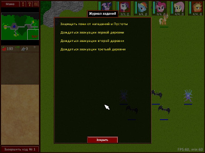
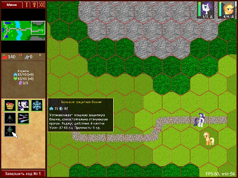

# Heroes of Equestria - Герои Эквестрии

Проект "Герои Эквестрии" - тактическая пошаговая игра с элементами
стратегий и RPG. Помимо классических противников вроде враждебных юнитов,
игроку предстоит противостоять разрушению ландшафта. Важным элементом
проекта также является набор индивидуальных особенностей каждого игрового
персонажа. По сравнению с классическими стратегиями, система строительства,
ресурсов и юнитов очень ограничена, но это компенсируется необходимостью
тактического управления группой игровых персонажей со своими особыми
навыками и характеристиками. Разнообразные миссии и подробный сюжет
должны составить привлекательный набор для фанатов My Little Pony и
ценителей авторских игр.

 

### Библиотеки и инструменты сборки

Для компиляции исходных файлов проекта из каталога `src` - необходима
IDE Delphi 10 или выше. Исполнимый файл будет собран в каталог `bin` или `bin/debug`, в зависимости от выбранного типа сборки (Release или Debug). Допустима только сборка для
платформы Win32.\
Для сборки проекта нужен движок `HGE`, его портированная версия для Delphi 10
с поправками под проект включена в `src/hge`.\
Для запуска проекта нужна библиотека `D3DX81ab.dll`, она включена в `bin` и
`bin/debug`.

Создание дистрибутива для Windows выполняется с помощью программы
[NSIS](https://nsis.sourceforge.io)

Создание архива для Windows выполняется с помощью консольного версии архиватора
[7Zip](https://7-zip.org)

### Состав репозитория

* `bin` - каталог сборки бинарного файла конфигурации Release
* `bin_debug` - каталог сборки бинарного файла конфигурации Debug
* `configs` - параметры игры, общие для всех сценариев
* `fonts` - шрифты в специальном формате для движка HGE
* `images` - графика игры, общая для всех сценариев
* `manuals` - руководство игрока и моддера
* `maps` - сценарии игры
* `scenes` - брифинги сценариев
* `setup` - скрипты для создания дистрибутива и архива
* `src` - исходный код игры в виде проекта для Delphi
* `usermaps` - каталог с примерами пользовательских сценариев

### Контакты

##### Официальный сайт проекта

https://heroesofequestria.org

##### Автор проекта

E-mail: tereshenkov@mail.ru\
Сайт: https://tereshenkov.ru\
вКонтакте: https://vk.com/tereshenkov_av\

##### Лицензирование и авторские права

Проект опубликован под лицензией CC0. Автор разрешает и приветствует
любое использование проекта, включая копирование, модификацию и создание
форков проекта.\
Права на использованных в игре персонажей и названий франшизы MLP -
принадлежат Hasbro Inc.
